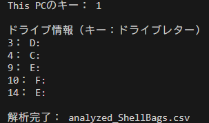
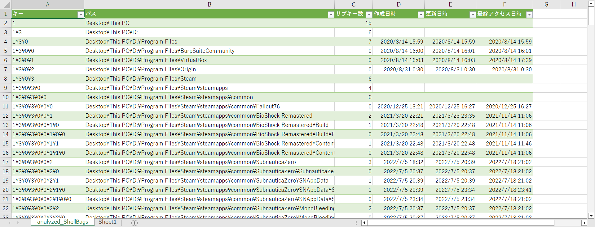

# shellbags-parser-test
## 概要
本ツールは、WindowsのアーティファクトであるShellBagsの __一部__ を抽出・解析するテストツールです。  
このツールでは、 `UsrClass.dat` の `\\Local Settings\\Software\\Microsoft\\Windows\\Shell\\BagMRU` 配下に存在するドライブ配下（Cドライブなど）のフォルダ情報を解析します。  
最終的にはフォルダパスを構築し、作成日時、更新日時、アクセス日時（JST）の情報をまとめてCSVファイルに出力します。  

詳細は[ブログ記事](https://swime.hatenablog.jp/)の方をご参照ください。

## 実行環境（参考）
Python 3.12.3

## インストール
```
pip install -r requirements.txt
```

## 実行例
解析対象の `UsrClass.dat` のパスを引数に指定して実行するだけです。  
※直接 `UsrClass.dat` にアクセスしようとするとロックがかかっているため、フォレンジックツール等で抽出したファイルに対して解析を行ってください。

```
python shellbags_parser_test.py UsrClass.dat
```

解析に成功すると以下のように表示され、 `analyzed_ShellBags.csv` が生成されます。  


CSVファイルの中身は以下のようになっており、各ドライブ配下のフォルダパスとアクセス日時（JST）などが記載されています。  
